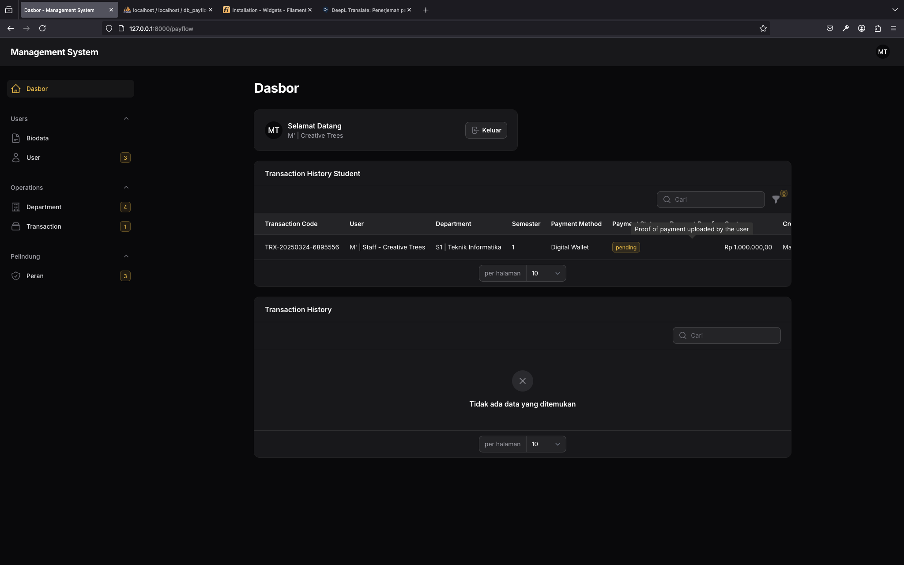
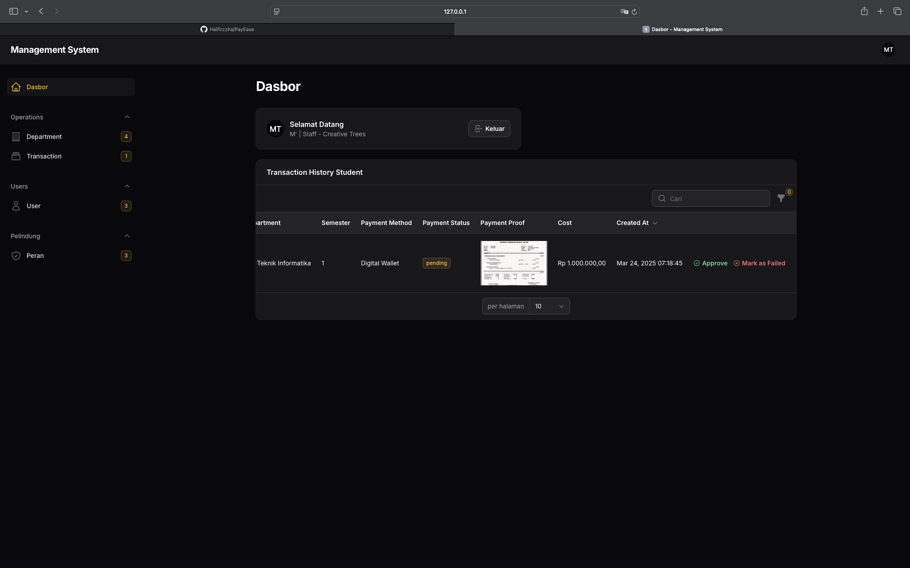
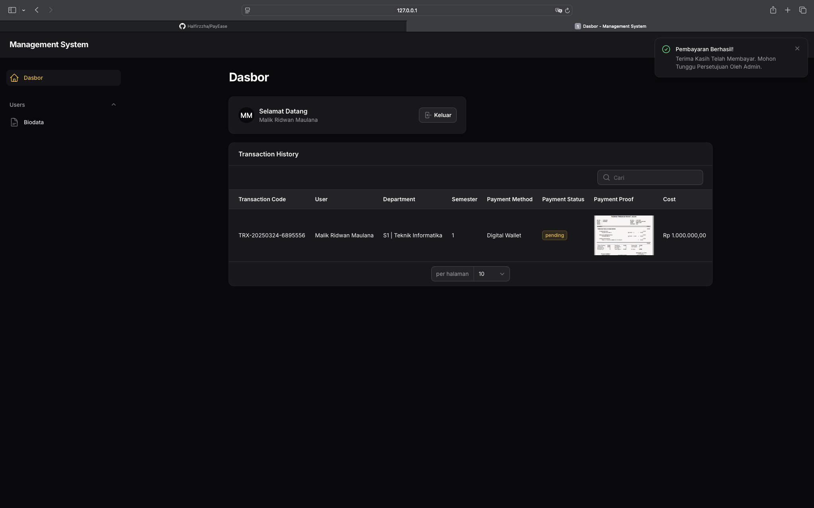

# PayEase - Sistem Manajemen Pembayaran

**PayEase** adalah aplikasi web berbasis Laravel yang dirancang untuk mengelola pembayaran, data pengguna, dan transaksi dengan efisiensi tinggi. Proyek ini menggunakan **Filament** sebagai panel admin, **MySQL** sebagai basis data, serta integrasi **Spatie Permission** dan **Filament Shield** untuk manajemen peran dan izin.

---

## Fitur Utama

- **Manajemen Pengguna**: Kelola pengguna dengan peran dan izin yang dapat disesuaikan.
- **Manajemen Transaksi**: Proses pembayaran dengan unggahan bukti pembayaran dan pelacakan status.
- **Manajemen Departemen**: Atur departemen dengan biaya dan semester terkait.
- **Autentikasi**: Registrasi pengguna dengan unggahan foto profil dan sertifikat.
- **Notifikasi Real-Time**: Pemberitahuan untuk pembaruan status pembayaran.
- **Manajemen Peran dan Izin**: Menggunakan **Spatie Permission** dan **Filament Shield** untuk kontrol akses.
- **Basis Data MySQL**: Penyimpanan data yang terintegrasi sepenuhnya dengan MySQL.

---

## Persyaratan Sistem

- **PHP**: Versi 8.2 atau lebih baru
- **Composer**
- **MySQL**
- **Laravel**: Versi 12
- **Filament Admin Panel**: Versi terbaru
- **Spatie Permission**: Untuk manajemen peran dan izin
- **Filament Shield**: Untuk integrasi izin dengan Filament

---

## Panduan Instalasi

Ikuti langkah-langkah berikut untuk menginstal dan menjalankan aplikasi:

### 1. Clone Repository

```bash
git clone https://github.com/Halfirzzha/PayEase.git
cd PayEase
```

### 2. Instalasi Dependensi

```bash
composer install
```

### 3. Konfigurasi Lingkungan

Salin file `.env.example` menjadi `.env` dan sesuaikan konfigurasi basis data Anda:

```bash
cp .env.example .env
```

Edit file `.env` untuk menyesuaikan kredensial MySQL:

```
DB_CONNECTION=mysql
DB_HOST=127.0.0.1
DB_PORT=3306
DB_DATABASE=db_payflow
DB_USERNAME=root (sesuaikan dengan konfigurasi Anda)
DB_PASSWORD=     (sesuaikan dengan konfigurasi Anda)
```

### 4. Generate Application Key

```bash
php artisan key:generate
```

### 5. Jalankan Migrasi dan Seeder

```bash
php artisan migrate --seed
```

### 6. Jalankan Server Pengembangan

```bash
php artisan serve
```

Akses aplikasi melalui `http://127.0.0.1:8000`.

---

## Cara Penggunaan

### Panel Admin

Panel admin **Filament** dapat diakses melalui `/payflow/login`. Gunakan kredensial admin default atau buat pengguna admin baru.

### Registrasi Pengguna

Pengguna dapat mendaftar melalui halaman `/payflow/register`. Mereka dapat mengunggah foto profil dan sertifikat saat proses registrasi.

### Transaksi

Pengguna dapat melihat riwayat transaksi mereka dan mengunggah bukti pembayaran. Admin dapat menyetujui, menandai sebagai tertunda, atau menolak transaksi.

### Departemen

Admin dapat mengelola departemen, termasuk nama, semester, dan biaya terkait.

### Manajemen Peran dan Izin

Gunakan **Spatie Permission** dan **Filament Shield** untuk mengatur peran dan izin pengguna. Peran dapat diberikan melalui panel admin.

---

## Gambar Masing - Masing Role
1. **Admin**: 
2. **Staff**: 
3. **User**: 

Gambar-gambar ini dapat digunakan untuk keperluan dokumentasi atau tampilan antarmuka aplikasi.

---

## Struktur Proyek

- **Models**: Terletak di `app/Models`, termasuk `User`, `Transaction`, dan `Department`.
- **Filament Resources**: Terletak di `app/Filament/Resources`, untuk mengelola operasi CRUD pada pengguna, transaksi, dan departemen.
- **Pages**: Halaman kustom Filament seperti `Biodata` dan `Payment` berada di `app/Filament/Pages`.
- **Widgets**: Widget kustom seperti `StudentTransaction` dan `PayminTransaction` berada di `app/Filament/Widgets`.

---

## Skema Basis Data

### Tabel `users`

- `id`: Primary key
- `name`, `email`, `password`, `phone`
- `photo`: Path foto profil
- `scan_certificate`: Path sertifikat yang diunggah

### Tabel `transactions`

- `id`: Primary key
- `code`: Kode transaksi unik
- `payment_method`: Enum (`cash`, `transfer`, `digital_wallet`)
- `payment_status`: Enum (`pending`, `complete`, `failed`)
- `payment_proof`: Path bukti pembayaran
- `user_id`: Foreign key ke tabel `users`
- `department_id`: Foreign key ke tabel `departments`

### Tabel `departments`

- `id`: Primary key
- `name`: Nama departemen
- `semester`: Nomor semester
- `cost`: Biaya terkait

---

## Kontribusi

Kontribusi sangat dihargai! Silakan fork repository ini dan kirimkan pull request Anda.

---
